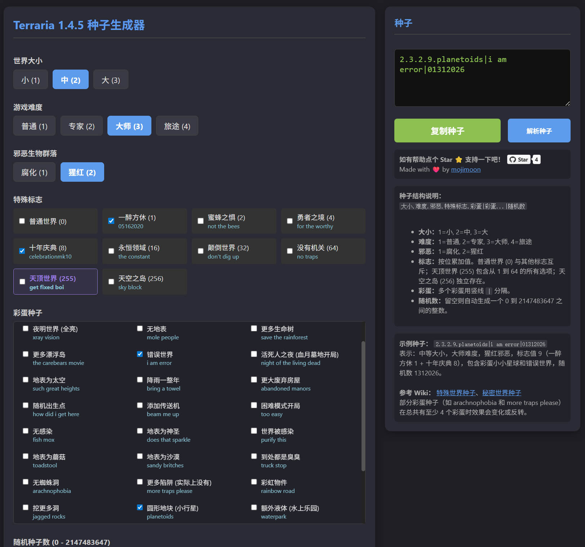

A collection of simple web applications. Have fun exploring!

## Tools

### Terraria 1.4.5 Seed Generator

Link: [/terraria](/terraria)

A Terraria 1.4.5 world seed generator that allows you to specify special world features and secret seeds.

### Minimax Visualizer

Link: [/minimax](/minimax)

A Minimax / Alpha-Beta pruning visualizer.

## Games

### Hardle

Link: [/hardle](/hardle)

A very simple fork of [hardle.org](https://hardle.org/) written in plain HTML/CSS/JS.

Hardle is a [Wordle](https://www.nytimes.com/games/wordle/index.html)-like game.

- Your goal is to guess a five-letter word in 10 tries or less.
- After each guess, the color of the tiles will change to show how close your guess was to the word. Green = correct, Yellow = present but in the wrong position, Gray = absent.
- However, unlike Wordle, **Hardle does not reveal the color of each tile**. Instead, it only tells you how many letters are correct (green) and present (yellow).

The word lists are taken from a [Gist](https://gist.github.com/cfreshman/dec102adb5e60a8299857cbf78f6cf57) by [cfreshman](https://github.com/cfreshman).

- `allowed.txt` contains 10657 words that can be used as guesses.
- `answers.txt` contains 2315 words that can be the answer.

Good luck and have fun!

### Klondike Solitaire

Link: [/klondike](/klondike)

A simple Klondike Solitaire game.

### Texas Hold'em Poker

Link: [/balatro](/balatro)

A simple Balatro clone implementing the core mechanics, inspired by Texas Hold'em poker.

### Arrow Puzzle

Link: [/arrow-puzzle](/arrow-puzzle)

An arrow puzzle game inspired by the minigame in "Exponential Idle".

